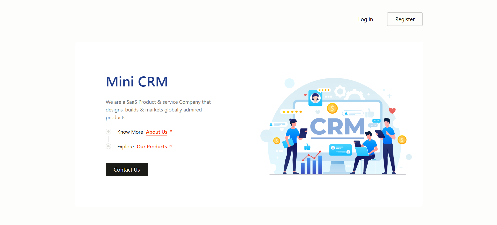
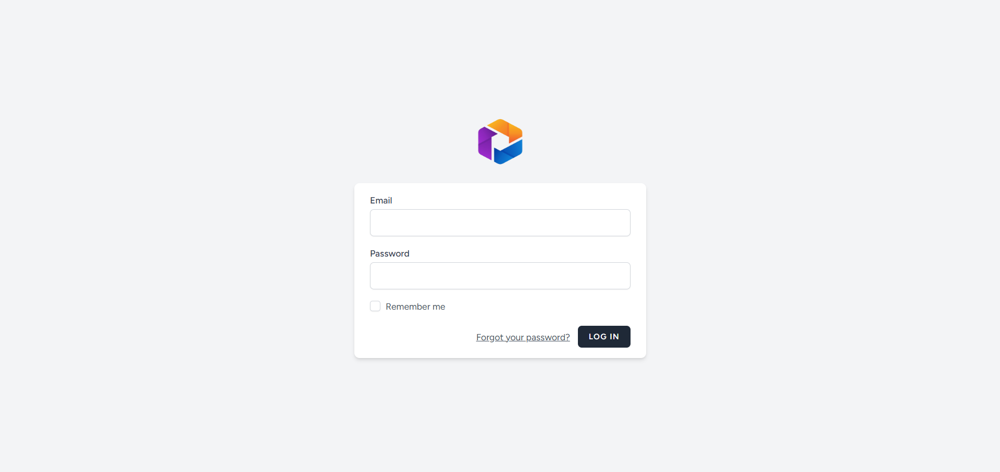
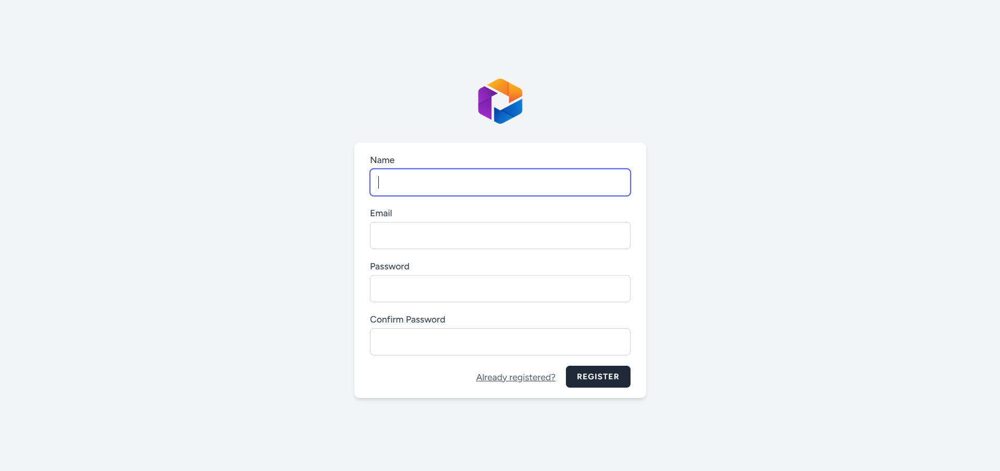
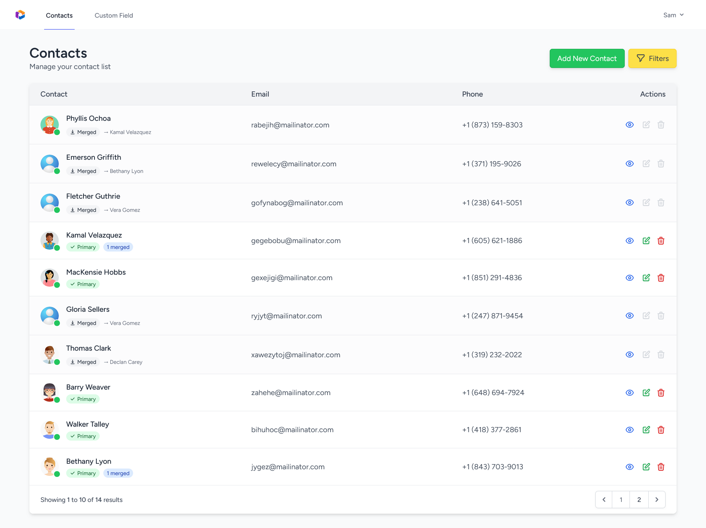

# Mini CRM 

A lightweight, feature-rich Customer Relationship Management (CRM) application built with Laravel 12. This Mini CRM is designed to manage contacts efficiently with powerful features like dynamic custom fields and an intelligent contact merging system, all within a modern, AJAX-driven interface.

## ✨ Features

### Core Contact Management (CRUD)
*   **Full Contact Lifecycle:** Create, view, update, and delete contact records seamlessly.
*   **Rich Contact Profiles:** Store standard information including Name, Email, Phone, Gender, Profile Image, and additional documents.
*   **AJAX-Powered Interface:** All create, edit, and delete operations happen asynchronously for a fast, single-page application (SPA) feel without frustrating page reloads.

### Dynamic Custom Fields
*   **Administrator Control:** Easily extend your contact data model. Administrators can add and manage unlimited custom fields (e.g., `Birthday`, `Company`, `Address`, `Twitter Handle`) directly from the UI.
*   **Flexible Data Storage:** Custom field data is stored using a scalable and extensible database schema, ensuring easy maintenance and future growth.
*   **Dynamic UI:** The contact form automatically renders these custom fields, providing a seamless experience for data entry and display.

### Advanced Search & Filtering
*   **Instant Results:** Search and filter your contact list in real-time using AJAX.
*   **Multi-Criteria Filters:** Find contacts quickly by filtering based on Name, Email, and Gender.
*   **Extensible Design:** The architecture supports future expansion to include filtering by any custom field.

### Intelligent Contact Merging
*   **Prevent Duplicates:** Clean your database by merging duplicate contact records.
*   **Master Record Selection:** A intuitive popup/modal workflow allows you to choose which contact will serve as the primary "master" record.
*   **Conflict Resolution:**
    *   Standard fields from the master record are preserved.
    *   Unique emails and phone numbers from the secondary contact are added to the master.
    *   Custom fields are merged intelligently: new fields are added, and conflicts are resolved by preserving the master's data by default (configurable logic).
*   **Zero Data Loss:** The merge process is non-destructive. The secondary contact is deactivated (not deleted) and all its data is preserved within the master record, maintaining full data integrity and auditability.

## 🛠️ Technology Stack

*   **Backend Framework:** Laravel 12
*   **Frontend:** Tailwind CSS
*   **Database:** MySQL

## 📦 Installation

1.  **Clone the repository:**
    ```bash
    git clone https://github.com/your-username/mini-crm.git
    cd mini-crm
    ```

2.  **Install PHP Dependencies:**
    ```bash
    composer install
    ```

3.  **Setup Environment:**
    ```bash
    cp .env.example .env
    php artisan key:generate # If using Laravel
    ```
    Edit the `.env` file with your database credentials.

4.  **Setup Database:**
    ```bash
    php artisan migrate --seed # If using Laravel
    # Or run the included SQL schema file for other frameworks.
    ```

5.  **Serve the Application:**
    ```bash
    php artisan serve # For Laravel
    # or configure your preferred web server (Apache/Nginx).
    ```
## 🚀 Usage

1.  **Managing Custom Fields:** Navigate to the "Custom Fields" section in the sidebar to create new fields (e.g., "Birthdate" of type `date`). These will instantly appear on the Contact creation and edit forms.
2.  **Adding Contacts:** Click "Add New Contact", fill out the standard and any custom fields, and save. The form will submit via AJAX.
3.  **Searching:** Use the search bar and filters at the top of the contacts list. Results update as you type.
4.  **Merging Contacts:**
    *   Select the contact to be merged.
    *   Click the "Merge" button.
    *   In the modal, select the contact you wish to keep as the **Master**.
    *   Confirm the merge. The master contact will now contain all combined data.

## 🚀 Screenshots










